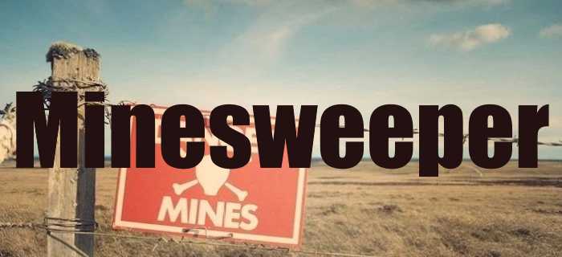

#### Video Demo: https://youtu.be/FmcvxSywN1o

## Introduction
A classic Minesweeper game.

#### Operations:
- Launch by running `main.py`
- Left mouse button to reveal a cell
- Right mouse button to flag a cell as potential mine
- ESC to quit game

#### Objective:
Reveal all non mine cells in the field. You do not have to flag all the mines.

#### Mechanics:
- First cell revealed is never a mine. The mine is transferred to a random free cell.
- Revealing a cell with zero mines nearby will automatically reveal all neighboring cells. 
It will continue doing so for every cell with zero mines nearby, recursively.
- Flagging a cell will disable controls, preventing you from miss-clicking on it, until unflagged.

#### Features:
- **Resizable interface**: Game adapts to you changing the window size and the number of cells
- **Game settings**: Change the settings in-game with a menu bar or out-of-game in a 
`config.ini` file
- **Mines left counter**: Accurately tracks how many mines are left unflagged
- **Game Timer**: Tracks how much time it took to beat the game

## Project selection and motivations
#### Why Minesweeper:
I love the game of minesweeper. I used to play it quite a bit on the older windows versions.
Once I saw it come up as a recommendation for a beginner project, I knew I had to do it!
I was also interested in creating a desktop application, and this game seemed like a great
fit for `tkinter`. It does not have a constantly refreshing interface, but instead awaits
user input like a regular application.

#### Goals:
- Learn basics of `tkinter`. Just enough to be familiar with how desktop interface works and 
want it takes to create a stand-alone app.
- Make a scalable interface that would fit the window in any direction the user decided to
stretch it.
- Use and external file to store settings.

## Outcome and challenges
#### `Tkinter` is difficult to learn:
The most comprehensive documentation I could find was an archive of a deleted site for 
the previous versions of `tkinter`. Tutorials turned out to be wrong more than once. 
Examples often showing a roundabout way of doing things. 
It takes effort to find good information, but it is out there if you look hard enough.

#### Making the interface scale with window size is difficult:
Most games make it seem simple. You just drag the window and the game fits the new size.
Those games however usually keep their aspect ratio constant. 

I feel like desktop apps were not meant for the type of scaling that I chose. It felt like
I was doing something not intended, and some compromises had to be made.

*I am not fully happy with the end result.* With bigger games, it sometimes looks a bit weird.
Dynamically scalable text was very glitchy and had to be replaced with resizing text when
you hit the reset button.

#### Emoji are great!:
While I initially planned to use images for everything in this game, I later switched 
completely to Unicode emojis. I feel like they are much more efficient and easier to
implement in a resizable interface. The only drawback is that there is
not a 'mine' emoji. But the one for 'web' in `tkinter` is a close enough replacement both
visually and thematically.

#### Sometimes it's the little things that take the most time:
Implementing the settings class and  especially the custom settings panel took much longer
than expected. It involved dealing with entries and user input, which require validation.

A lot of time was spent on inbuilt validation in `tkinter.Entry`,
which I ultimately failed to get to work. It was replaced with validation during 
submission.

## Credits
Thank you to all the creators that make tkinter tutorials.

Special thanks to this playlist on YouTube:
[Python GUI's With Tkinter](https://youtube.com/playlist?list=PLCC34OHNcOtoC6GglhF3ncJ5rLwQrLGnV)
by Codemy.com for breaking down tkinter into digestible chunks.

Also, this tutorial:
[Python Game Development Project Using OOP – Minesweeper Tutorial (w/ Tkinter)](https://youtu.be/OqbGRZx4xUc) 
by freeCodeCamp.org.
It helped me with the first hurdle of 'knowing where to start' as I loosely followed the 
first hour of it.

[The most comprehensive tkinter documentation](https://anzeljg.github.io/rin2/book2/2405/docs/tkinter/index.html)
for me was this GitHub archive of New Mexico Tech website.

Icon art taken from here: [thenounproject.com](https://thenounproject.com/icon/mine-915944/)